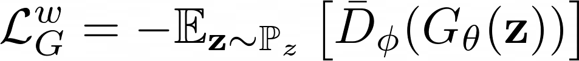
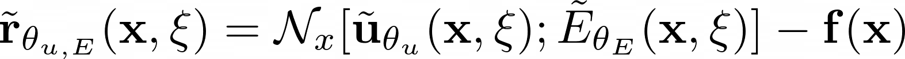
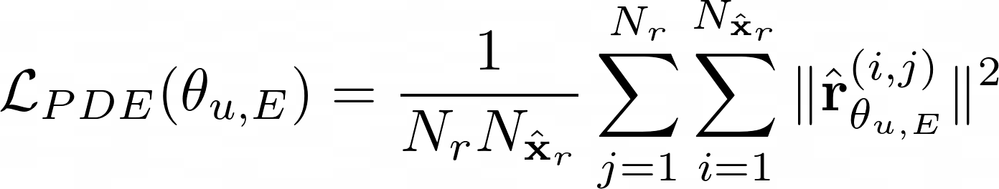
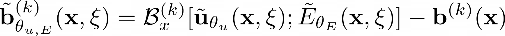
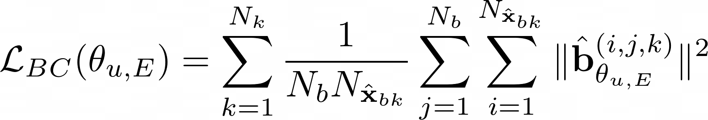
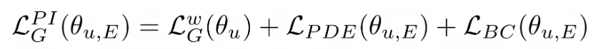
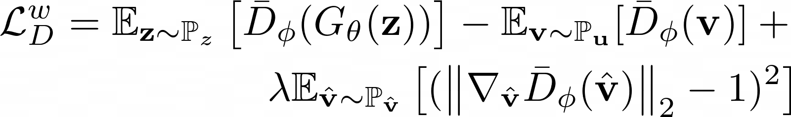

# Inverse Estimation of Elastic Modulus Using Physics-Informed Generative Adversarial Networks

This repo contains the code and data used to generate the results in the report:
```
J. Warner, J. Cuevas, G. Bomarito, P. Leser, and W. Leser. Inverse Estimation of Elastic Modulus 
Using Physics-Informed Generative Adversarial Networks. NASA/TM-2020-5001300. May 2020.
```

## Dependencies
*  Python 3
*  Tensorflow 2

All additional modules required that can be found in requirements.txt

```python
pip install -r requirements.txt
```

## Usage

### 1) Dataset Generation
The training/testing data used for the report can be found in the `data/` directory, 
so this step is optional. If you would like to create your own data (change the
number of sensors, collocation points, etc. used), see the **generate_pigan.py** script.

### 2) Training

Use the **train_pigan.py** file to train the PIGAN using the generated training data.
To visualize realtime metrics, use Tensorboard. Use the command:
```
 tensorboard --logdir "data/tensorboard/"
```
and then follow the link provided in Chrome to see the graphs.

### 3) Generating Predicitons and Analyzing Results

To generate samples with the trained PIGAN and assess accuracy versus the testing data, 
use the **evaluate_pigan.py** script. Be sure to specify the location of your trained models, 
or use the models in the paper, which reside in the `data/paper_models/` folder.
This python script will generate data using the model and recreate many of the 
report. After the script runs, the plots will be saved as pdfs in `data/plots/`.


## PI-GAN Architecture

### The Generator

The Generator is composed of two feed forward deep neural networks (DNNs) that generate values for u and E, respectively. <br>
It learns to estimate the probability distribution through 3 seperate loss terms: <br>

**WGAN Loss** is the loss associated with the Discriminator:<br> <br>
 <br>


**PDE Loss** is found by evaluating the generated samples at collocation points and computing the PDE's residual: <br><br>
 <br> <br>
The residual is then averaged over all samples and collocation points: <br><br>
 <br>

The implementation of PDE loss can be found in [pde.py](pigan/components/pde.py).<br>

**Boundary Condition Loss** is calculated similarly. First generated samples are evaulated at collocation points on the boundary: <br><br>
 <br><br>
The residual is then averaged over all samples and boundary collocation points: <br><br>
 <br><br>

The implementation of Boundary Condition loss can be found [boundary_conditions.py](pigan/components/boundary_conditions.py).

These losses are combined to find the **Total Loss**: (Note: Our results equally weighted all three loss types)  <br><br>
 <br>


### The Discriminator
The Discriminator looks at the samples of u being generated and scores them on how close they are to the real expected values of u. <br>

It also enforces the gradient penalty, which encourages the discriminator gradients towards unity:

 

<br>
See the report for more details on the PIGAN formulation.

## Acknowledgements

* The authors thank Theodore Lewitt (USC) for his help in preparing the code in this repo.

